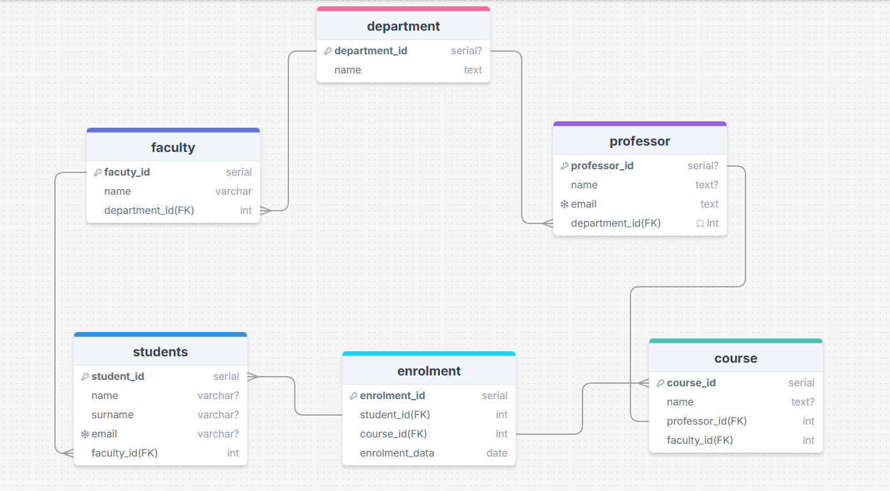

This DATABASE used for control university managament system.

There are **6 main tables** in this database:

1. **department**  
2. **professor**  
3. **faculty**  
4. **course**  
5. **student**  
6. **enrolment**

---

## 🔗 Table Relationships

### 🧩 Department
- A **department** can have **many professors**.
- A **department** can have **many faculties**.  
  → **professor** → **department** = Many-to-One  
  → **faculty** → **department** = Many-to-One  

### 👨‍🏫 Professor
- Each **professor** belongs to **one department**.  
- Each **course** is taught by **one professor** (and each professor teaches exactly one course).  
  → **course** ↔ **professor** = One-to-One

### 🏫 Faculty
- A **faculty** belongs to **one department**.  
- A **faculty** can have **many courses**.  
- A **faculty** can have **many students**.  
  → **course** → **faculty** = Many-to-One  
  → **student** → **faculty** = Many-to-One  

### 📚 Course
- Each **course** is linked to one **professor** (1:1).
- Each **course** belongs to one **faculty** (many-to-one).
- Each **course** can have many **enrolments**.

### 👨‍🎓 Student
- A **student** belongs to one **faculty**.
- A **student** can be enrolled in **many courses** through the **enrolment** table.  

### 📝 Enrolment
- The **enrolment** table is a **junction (bridge)** table connecting:
  - **student** ↔ **course**
- It also includes:
  - `enrollmentDate` — when the student enrolled in the course.
